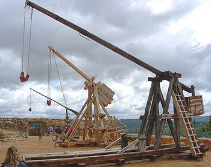
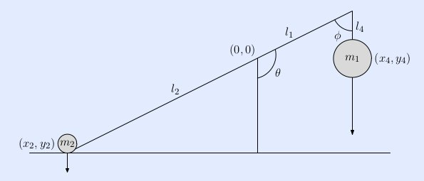
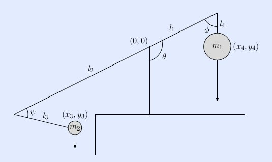
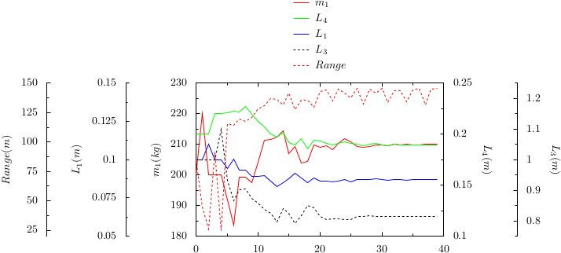

.. footer:: `<https://github.com/crmccreary/trebuchet-optimization.git>`_

====================================
Using Python To Optimize a Trebuchet
====================================

Presenter
+++++++++

* Charles McCreary, P.E.

  * CRM Engineering Services
  * Using Python to develop applications since 2000
  * Scientific/Engineering applications
  * Back office type applications
  * Django web apps
  * But mainly a structural engineer, stress and thermal analyst

Projects
++++++++++++++++

Offshore wind turbine foundations

Projects
++++++++++++++++

LED lighting

Projects
++++++++++++++++

Hoover-Diana Topsides

Projects
++++++++++++++++

Chips

What do any of these projects have to with Python?
++++++++++++++++++++++++++++++++++++++++++++++++++

.. class:: incremental

* Significant data processing is required
* Parametrization
* Generating reports
* Building analysis tools

Engineering Notebooks
+++++++++++++++++++++

.. class:: incremental

* Engineers need to document their calculations
* The available tools are expensive
* And, being proprietary, not very flexible
* I like Mathematica and barely tolerate MathCAD, but I was looking for a replacement

Why a trebuchet?
++++++++++++++++

.. class:: incremental

* We needed a demonstration project to verify that we could replace MathCad with the ipython notebook
* It would be fun

Trebuchets and medieval siege weapons
+++++++++++++++++++++++++++++++++++++

A trebuchet is a medieval siege weapon that combines two ancient weapons, the traction catapult and the sling, into one. A trebuchet consists of a beam mounted on an axle with a heavy counterweight mounted on the short end and a sling attached to the long end. 

Essentially it is a triple pendulum:

.. class:: incremental

1. A hinge at the counterweight pendulum and beam
2. A hinge at the axle
3. A hinge at the sling and beam

Trebuchets and medieval siege weapons
+++++++++++++++++++++++++++++++++++++

Or not so medieval 
++++++++++++++++++

.. image:: assets/drug_trebuchet.jpg
   :align: center
   :scale: 130%

Mechanics of a Trebuchet
++++++++++++++++++++++++

References:

`Modern Siege Weapons: Mechanics of the Trebuchet <http://online.redwoods.cc.ca.us/instruct/darnold/deproj/sp05/bshawn/presentation.pdf>`_

`Algorithmic Beauty of the Trebuchet <http://www.algobeautytreb.com/trebmath35.pdf>`_

See-saw Idealization
++++++++++++++++++++

.. image:: assets/seesaw.jpg
   :align: center

Hinged Counterweight Idealization
+++++++++++++++++++++++++++++++++

Hinged Counterweight with Sling Idealization
++++++++++++++++++++++++++++++++++++++++++++

Tool Chain
++++++++++

* Python
* sympy - 0.7.1-git `<https://github.com/sympy/sympy>`_
* ipython - 0.13+ `<https://github.com/ipython/ipython.git>`_
* numpy
* scipy 
* jinja2
* pyx - for awesome, publication quality plots
* Abaqus - a general purpose finite element analysis program ($$$)

Mechanics of the see-saw
++++++++++++++++++++++++

Mechanics of the hinged counterweight
+++++++++++++++++++++++++++++++++++++

Mechanics of the hinged counterweight with sling
++++++++++++++++++++++++++++++++++++++++++++++++

Optimization using Scipy and Abaqus
+++++++++++++++++++++++++++++++++++

The ``scipy.optimize`` package provides a number of optimization methods. We need the following:

* Multivariate optimization
* We can't easily compute a Jacobian
* The problem is very nonlinear
* We have a number of constraints

I have found that the ``fmin_cobyla`` works well. 

Cobyla - Constrained optimization by linear approximation

Optimization using Scipy and Abaqus
+++++++++++++++++++++++++++++++++++

Sometimes I find it useful to parametrize the parameters if the scale of the parameters are quite different. In that case, I use the `scipy.stats.logistic` function to not only scale the parameters from 0 to 1, but introduce a pseudo constraint.

.. math::

     P(t) = \frac{1}{1+e^{-t}}

Optimization using Scipy and Abaqus
+++++++++++++++++++++++++++++++++++

.. image:: assets/500px-Logistic-curve.svg.png
   :align: center

Optimization using Scipy and Abaqus
+++++++++++++++++++++++++++++++++++

Since I plan to build the resulting trebuchet, I need to constrain the size. So I fix :math:`L_2 = 1.0m` and :math:`m_2 = 0.2 kg`, approximately the mass of an orange.

Constraints

* :math:`m_1 > 0` 
* :math:`L_1 > 0` 
* :math:`L_4 > 0` 
* :math:`L_4 > 0` 

Calculation of range
++++++++++++++++++++

* Assume projectile release occurs when sling and beam are colinear
* This will occur when the beam is at some angle :math:`\theta`

  * The angle of the tangential velocity vector from horizontal is also :math:`\theta`

Calculation of range
++++++++++++++++++++

Calculation of range
++++++++++++++++++++

The range is then calculated from

.. math::

    d = \frac{v \cos \theta}{g}\left( v \sin \theta + \sqrt{v^2 \sin^2 \theta + 2 g y _0}\right)

where

.. math::

   \begin{eqnarray}
      v    & = & \mbox{Velocity magnitude}\\
      g    & = & \mbox{Gravity}\\
      y_0  & = & \mbox{Height of projectile at release}
   \end{eqnarray}

Calculation of range
++++++++++++++++++++

The preceding is valid for the moon, mars, or anywhere with negligible air resistance such as high school physics textbooks. With drag, the range will be a lot less and the maximum range is achieved with a much shallower angle. See the notebook `Range_with_drag` for a more realistic treatment.

Optimization Sequence
+++++++++++++++++++++

1. `trebuchet_optimize.py` drives the simulation
2. A `jinja2` template is used for the input file
3. The parameters are rendered onto the template
4. The objective function, calculation of the range, is performed
5. `cobyla` does its stuff, checks the parameters against the constraint functions
6. Rinse and repeat until the tolerances on the changes in the parameters are met

Abaqus finite element simulation
++++++++++++++++++++++++++++++++

.. raw:: html

         <object width="640" height="360"><param name="movie" value="http://www.youtube.com/v/UpppHpe-Qvs?version=3&amp;hl=en_US&amp;rel=0"></param><param name="allowFullScreen" value="true"></param><param name="allowscriptaccess" value="always"></param><embed src="http://www.youtube.com/v/UpppHpe-Qvs?version=3&amp;hl=en_US&amp;rel=0" type="application/x-shockwave-flash" width="640" height="360" allowscriptaccess="always" allowfullscreen="true"></embed></object>

Range vs Variable Permutations
++++++++++++++++++++++++++++++

Calculated efficiency: 46.6%

