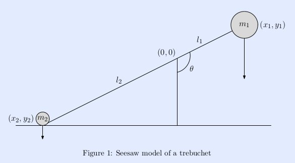

.. footer:: `<https://github.com/crmccreary/trebuchet-optimization.git>`_

====================================
Using Python To Optimize a Trebuchet
====================================

Presenter
+++++++++

* Charles McCreary, P.E.

  * Using Python to develop applications since 2000

  * Scientific/Engineering applications

  * Back office type applications

  * Django web apps
    
  * CRM Engineering Services

Why?
++++

* I wanted a demonstration project to verify that we could replace MathCad with the ipython notebook

* It would be fun

Trebuchets and medieval siege weapons
+++++++++++++++++++++++++++++++++++++

A trebuchet is a medieval siege weapon that combines two ancient weapons, the traction catapult and the sling, into one. A trebuchet consists of a beam mounted on an axle with a heavy counterweight mounted on the short end and a sling attached to the long end. 

Essentially it is a triple pendulum:

1. A hinge at the counterweight pendulum and beam

2. A hinge at the axle

3. A hinge at the sling and beam

Trebuchets and medieval siege weapons
+++++++++++++++++++++++++++++++++++++

.. image:: assets/350px-Trebuchet_Castelnaud.jpg

Or not so medieval 
++++++++++++++++++

Mechanics of a Trebuchet
++++++++++++++++++++++++

I have borrowed heavily from 

`Modern Siege Weapons: Mechanics of the Trebuchet <http://online.redwoods.cc.ca.us/instruct/darnold/deproj/sp05/bshawn/presentation.pdf>`_

See-saw Idealization
++++++++++++++++++++

Hinged Counterweight Idealization
+++++++++++++++++++++++++++++++++

.. image:: assets/TrebuchetMotion_1.jpg

Hinged Counterweight with Sling Idealization
++++++++++++++++++++++++++++++++++++++++++++

.. image:: assets/TrebuchetMotion_2.jpg

Tool Chain
++++++++++

* Python
* sympy - 0.7.1-git `<https://github.com/sympy/sympy>`_
* ipython - 0.13+ `<https://github.com/ipython/ipython.git>`_
* numpy
* scipy 
* jinja2
* Abaqus - a general purpose finite element analysis program ($$$)

Mechanics of the see-saw
++++++++++++++++++++++++

Mechanics of the hinged counterweight
+++++++++++++++++++++++++++++++++++++

Mechanics of the hinged counterweight with sling
++++++++++++++++++++++++++++++++++++++++++++++++

Optimization using Scipy
++++++++++++++++++++++++

Calculation of range
++++++++++++++++++++

.. math::

    \psi(r) = e^{-2r}

.. math::

   \begin{eqnarray}
      y    & = & ax^2 + bx + c \\
      f(x) & = & x^2 + 2xy + y^2
   \end{eqnarray}

Abaqus finite element simulation
++++++++++++++++++++++++++++++++

.. raw:: html

        <object width="480" height="385"><param name="movie"
        value="http://www.youtube.com/v/SBqYZ3KdAUc&hl=en_US&fs=1&rel=0"></param><param
        name="allowFullScreen" value="true"></param><param
        name="allowscriptaccess" value="always"></param><embed
        src="http://www.youtube.com/v/SBqYZ3KdAUc&hl=en_US&fs=1&rel=0"
        type="application/x-shockwave-flash" allowscriptaccess="always"
        allowfullscreen="true" width="480"
        height="385"></embed></object>

Range vs Variable Permutations
++++++++++++++++++++++++++++++

numpy and scipy - The Good
++++++++++++++++++++++++++

* Indispensable

numpy and scipy - Needs Work
++++++++++++++++++++++++++++

* Not smart enough to critique!

ipython notebook - The Good
+++++++++++++++++++++++++++

* So far, it has completely replaced MathCad

ipython notebook - Needs Work
+++++++++++++++++++++++++++++

* If running on a server, how do you import an image if not on server?

sympy - The Good
++++++++++++++++

* Suits our needs better than MathCad

sympy - Needs Work
++++++++++++++++++

* Not quite Mathematica

* sympy.physics units

  * Always reduces to base units
    
.. math::

    N = \frac{m}{s^2}kg

sympy - Needs Work
++++++++++++++++++

* At present, there does not seem to be a very good way to convert the symbolic results to python code

    * Can convert to Fortran or C

    * Thus cannot feed directly into scipy diffeq solvers. You must copy and paste.
